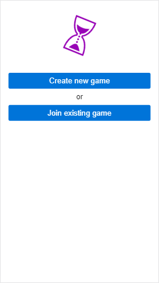

This is a server-client setup that allows multiple clients to connect to a game room and play a game with each other. The server is written in Go and the client is written in JS, and the primary communication is with web workers.

Screenshots

This project is inspired by the fact that a large part of the world has been sheltering in place to slow the spread of the COVID-19 pandemic.
