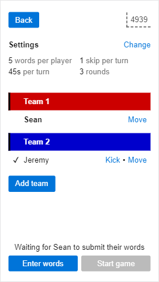
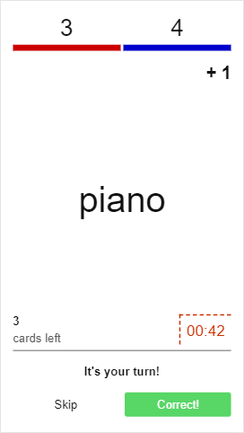

## Summary

This is a server-client setup that allows multiple clients to connect to a game room and play a game with each other. The server is written in Go and the client is written in JS, and the primary communication is with web workers.

## Supported game types

### Fishbowl

Players submit words or phrases and divide into teams, and then those phrases are used during gameplay. Gameplay consists of each player trying to get their teammates to guess as many phrases as possible before the time runs out.

 

### Codenames

(In progress)

> Two teams compete to see who can make contact with all of their agents first. Spymasters give one-word clues that can point to multiple words on the board. Their teammates try to guess words of the right color while avoiding those that belong to the opposing team. And everyone wants to avoid the assassin.

https://boardgamegeek.com/boardgame/178900/codenames

## About

This project was started in April 2020, inspired by the fact that a large part of the world has been sheltering in place to slow the spread of the COVID-19 pandemic.
